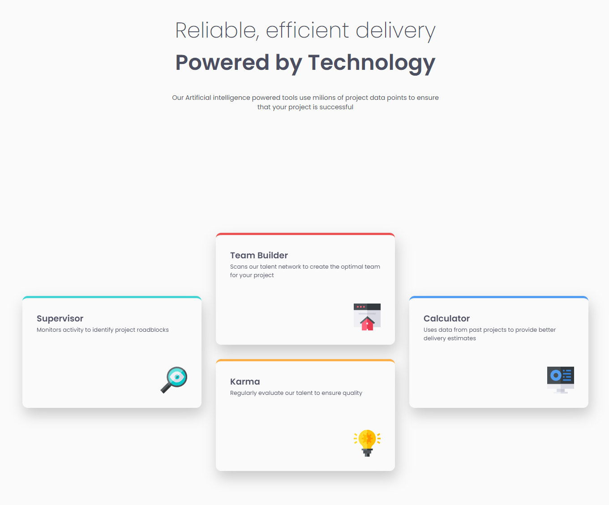

# Frontend Mentor - Product Preview Solution

Hi, Niels here.
This is a solution to the [Four card feature section challenge on Frontend Mentor](https://www.frontendmentor.io/challenges/four-card-feature-section-weK1eFYK).
[Hosted on GH Pages](https://nielsfechtel.github.io/frontendmentor_2_four_cards/).

## Table of contents

- [Frontend Mentor - Product Preview Solution](#frontend-mentor---product-preview-solution)
  - [Table of contents](#table-of-contents)
  - [Overview](#overview)
    - [Screenshot](#screenshot)
    - [What I learned](#what-i-learned)
  - [Author](#author)

## Overview

### Screenshot



### What I learned

I was using `height: 100%` or `height: 100dvh` on `body`, but content kept overflowing; then by chance I saw Kevin Powell using the 'svh'-unit, and like magic it fixed this. Will need to do more research on why, but I know it stands for 'small viewport height' as opposed to 'dynamic'.

```css
body {
  height: 100svh;
}
```

## Author

- Website - [Niels Fechtel](https://niels-fechtel.com)
